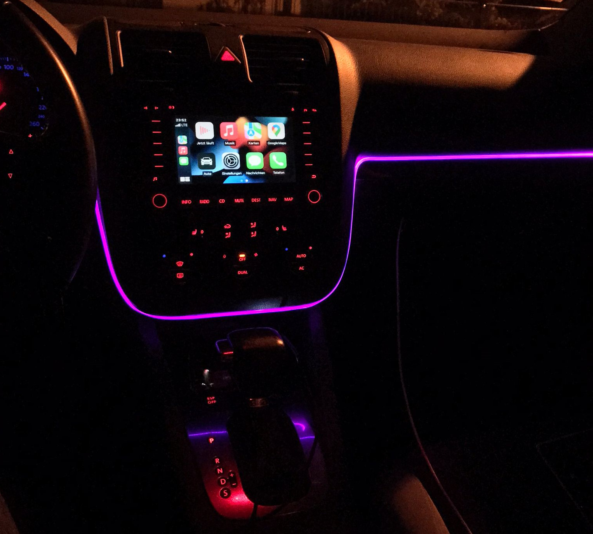

# mfd2plusplus
Adding new functionality to the Golf MK5 :)

# What does it do?
It allows you to retrofit Apples Carplay into your old car and do much more :)

For example, you can also interface with the Cluster to Display custom messages and menus or track data from the car

Since we don't get any new Maps this is a perfect fit to modernize your car while keeping a stock look without crappy chinese hardware.

This project exploits the fact that the MFD2 switches into aux mode (controlled by the vswitch pin) where we can supply a video signal and get all button inputs *regardless of how fast the car drives*
# What is needed?

- Raspberry Pi (2 is tested)
- Automotive grade (filtered) step down converter (12v->5v)
- USB Soundcard
- CAN to SPI board
- A handful of optokoplers, resistors and Nch-Mosfets
- 1-2 Relays if you want to switch power to your Sub/Camera
- Autobox dongle
- USB cvbs dongle (if you want a rear view cam)
- Hdmi to VGA dongle (connect like [Here](https://www.buessert.de/Technik/Linux/RaspberryPi/CarPi/index.htm))
- Some beer to handle your depression while assembling all this

# I have a RNS510, is it compatible too?
It should be compatible, since it has the same video input too.

The only difference is, that "VSwitch" is missing, meaning that we either have to simulate a TV Tuner and unlock the speed limit or Simulate a rear view camera 

(If someone has CAN dumps this would be really helpful)

# TODO
- Complete (and test) the C# Codebase
- Make a "all in one" Pi Hat
